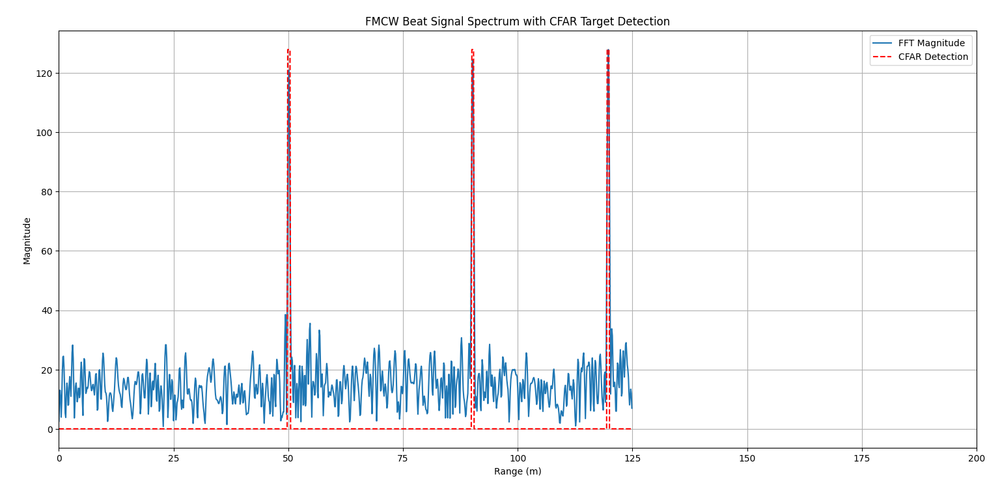

# radar-research-simulations
##  Received Power vs Distance

This graph shows how the radar signal strength decreases with increasing distance.

##  Doppler Simulation Output

##  Echo Delay Visualization

# FMCW Radar with CFAR Detection

This project simulates an FMCW (Frequency Modulated Continuous Wave) radar system and applies **CFAR (Constant False Alarm Rate)** detection to identify multiple targets at different ranges.

---

## 📡 Features

- Simulates FMCW radar signal transmission and reception
- Models multiple target reflections at known ranges
- Computes beat signal and extracts range profile using FFT
- Applies CFAR algorithm for automatic peak detection
- Plots FFT magnitude with detected targets over range

​
