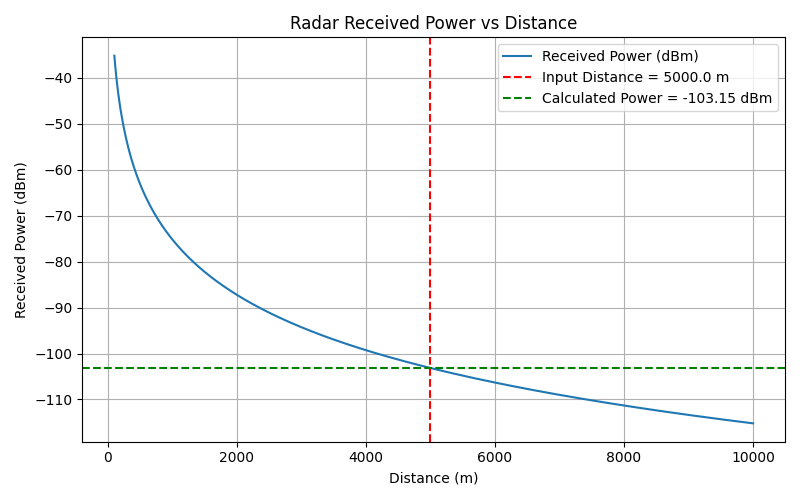
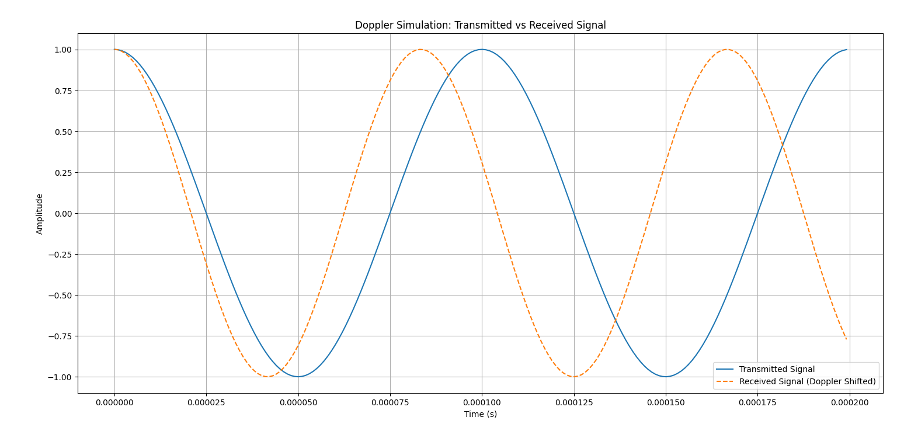
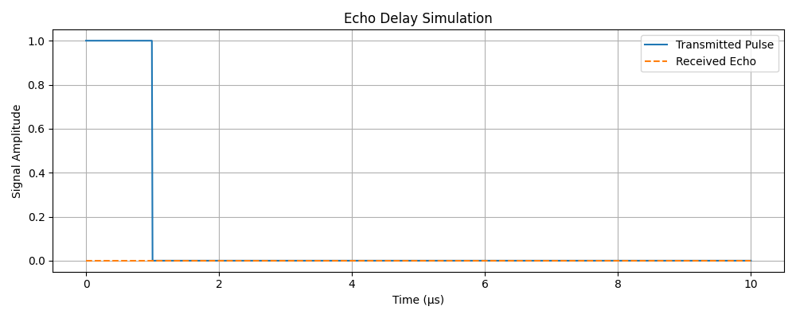

# radar-research-simulations
##  Received Power vs Distance

This graph shows how the radar signal strength decreases with increasing distance.

##  Doppler Simulation Output

##  Echo Delay Visualization

​
